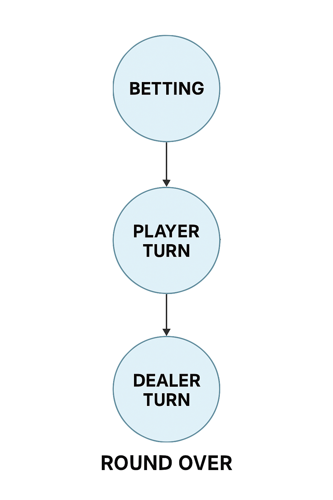

# Blackjack Game in Python

A fully functional Blackjack game built in Python, featuring both a console-based interface and a graphical user interface (GUI) using Pygame. Developed as a final project for the course *Introduction to Python and Data Science* at ETH Zürich.

---

## Project Goals

This project was created to:
- Apply object-oriented programming (OOP) principles to model a card game.
- Implement Blackjack game logic including player actions, dealer behavior, and betting.
- Develop a visually interactive game interface using Pygame.
- Manage game state transitions using a clear state machine.

---

## Features

### Console Version
- Simple terminal-based gameplay.
- Clean class design: `Card`, `Deck`, `Hand`, `Chips`.
- User prompts for hitting, standing, and betting.
- Ace value adjustment to prevent busts.
- Dealer follows Blackjack rules: hits until 17 or higher.

### GUI Version (Pygame)
- Interactive interface with buttons, card graphics, and game messages.
- Four defined states: `STATE_BETTING`, `STATE_PLAYER`, `STATE_DEALER`, `STATE_ROUND_OVER`.
- Cards are drawn using scaled images or fallback graphics.
- Real-time game feedback through event-driven logic.

The following diagram shows how the GUI transitions through game states:



Figure 1 illustrates the finite state machine used to manage game logic. The game starts in the BETTING state, then moves through player and dealer actions before displaying the result and returning to the beginning. This design improves user experience and code maintainability.

---

## Project Structure

```
blackjack-python/
├── blackjack_game.py       # Console version logic
├── blackjack_gui.py        # Pygame GUI version
├── images/                 # Card image assets
├── figures/fsm.png         # State flow diagram
├── blackjack_report.pdf    # Full project report
└── README.md               # This file
```

---

## Report

The complete project documentation is provided in the report below:

**[Blackjack Game Report (PDF)](./blackjack_report.pdf)**

It includes:
- Game rules and mechanics
- Object-oriented design
- GUI architecture and functionality
- Game logic, event handling, and future work

---

## Getting Started

### Requirements
- Python 3.x
- Pygame (`pip install pygame`)

### Run the Console Version
```bash
python blackjack_game.py
```

### Run the GUI Version
```bash
python blackjack_gui.py
```

Ensure that the `images/` directory contains the necessary card images (e.g. Kenney card set).

---

## Future Enhancements

- Add sound effects and animations for actions
- Enable splitting and doubling down
- Implement multiplayer mode
- Track game statistics across rounds

---

## Author

**Alina Akopian**  
ETH Zürich  
Email: alina.akopian@student.ethz.ch

---

## License

This project is licensed under the MIT License.
